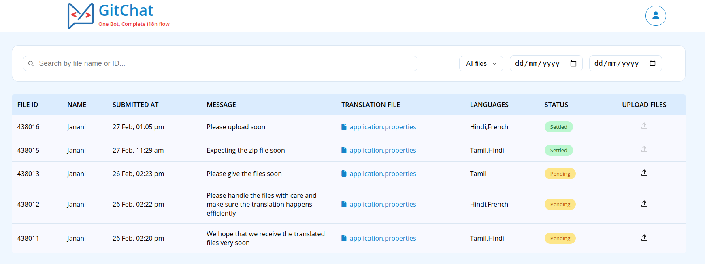
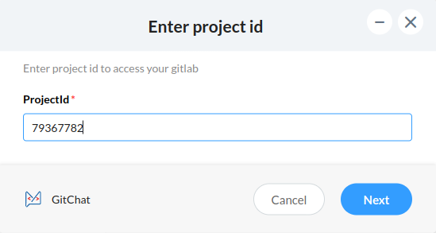
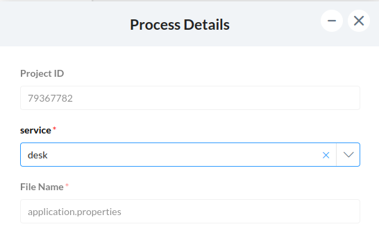
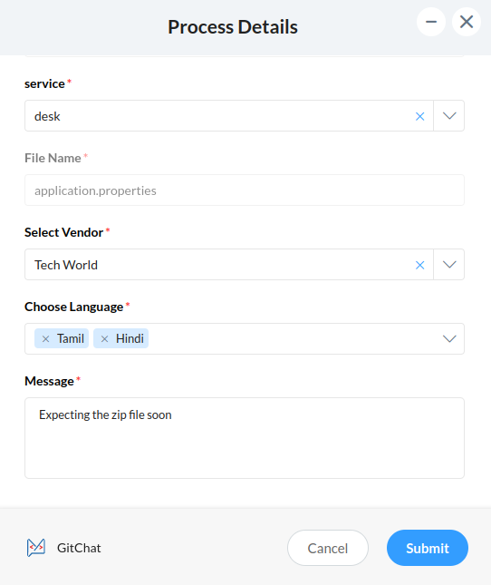
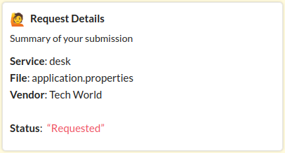
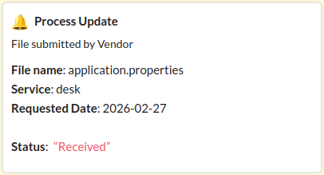
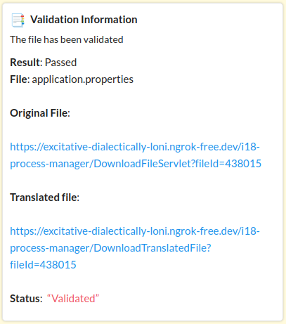
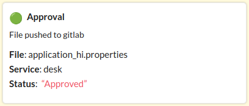
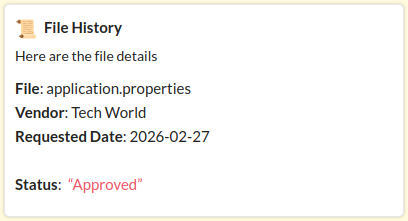

##Git Chat
**i18n simplified**
  

---

## 📌 Overview

**GitChat** is a Zoho Cliq bot designed to simplify and automate the internationalization (i18n) workflow for software development teams. It eliminates the need for manual coordination between developers and translation vendors by providing a structured, form-based request system with built-in validation, seamless GitLab integration for version control, and AI-powered instant translation through Zia — enabling a faster, more reliable, and fully streamlined localization process from request to delivery.

  

---

## 🎯 Problem It Solves

Managing i18n manually involves:

- Repeated vendor communication  
- Manual file validation  
- Version control complexity  
- Delays in translation turnaround  

GitChat streamlines the entire workflow inside Zoho Cliq with automation and AI assistance.

---

## 🤖 How GitChat Works

---

### 1. Triggering the Bot

  

When a developer types `git`, a structured request form opens prompting the developer to enter the **Project ID** to initiate the translation workflow.

---

### 2. Selecting Service (Folder)

  

After clicking **Next**, GitChat fetches the available services (folders), auto-fills the default file `application.properties`, and prepares the project context for the request.

---

### 3. Vendor & Language Selection

  

The user selects a vendor, supported languages are dynamically populated, an optional message can be added for the vendor, and the request is submitted for processing.

---

### 4. Request Confirmation Card

  

After submission, the developer receives a structured request summary card. The request is then forwarded to the selected vendor and the tracking process begins.

---

### 5. Vendor Upload & Notification

  

Once the vendor completes the translation and uploads the ZIP package, the developer receives a real-time notification card within Zoho Cliq.

---

## 🛠️ Commands Supported

---

### 🔍 /validate

Lists translated files uploaded by vendor.

---

#### 🔄 Workflow

Developer selects file

Validation is performed

Result is displayed as a card

---

#### 📦 Card Includes

Validation status

Errors (if any)

Download link

  

---

### ✅ /approval

Lists validation-passed files.

---

#### 🔄 Workflow

Developer selects file

File is pushed automatically to GitLab

Verification message shown

  

---

### 📜 /filehistory

Displays historical records of processed files.

---

#### 📊 View Includes

File name

Validation status

Approval status

Timestamp

GitLab push details

  

---

# 🧠 AI Integration – Zia Vendor

We integrated **Zia** as an AI-powered vendor.

When selected:

- Translation turnaround is extremely fast
- High-quality translation
- No validation failure possibility
- Automated processing

Zia enhances efficiency and eliminates manual delays.

---

# 🔗 GitLab Integration

Upon approval:

- Files are pushed directly to GitLab
- Repository is updated automatically
- Developer receives confirmation

This ensures:

- Version control consistency
- Zero manual Git operations
- Seamless CI/CD compatibility

---

# ✨ Key Features

📋 Dynamic Multi-Step Forms  
🌍 Vendor-based Language Mapping  
🤖 AI Translation Support  
📦 ZIP File Processing  
🔎 Automated Validation Engine  
🚀 GitLab Auto Push  
📜 File History Tracking  
🧾 Interactive Card Responses  

---

# 🛠️ Tech Stack

- Zoho Cliq Bot Platform  
- Deluge Scripting  
- GitLab API Integration  
- i18n Properties Handling  
- AI Integration (Zia)  

---
